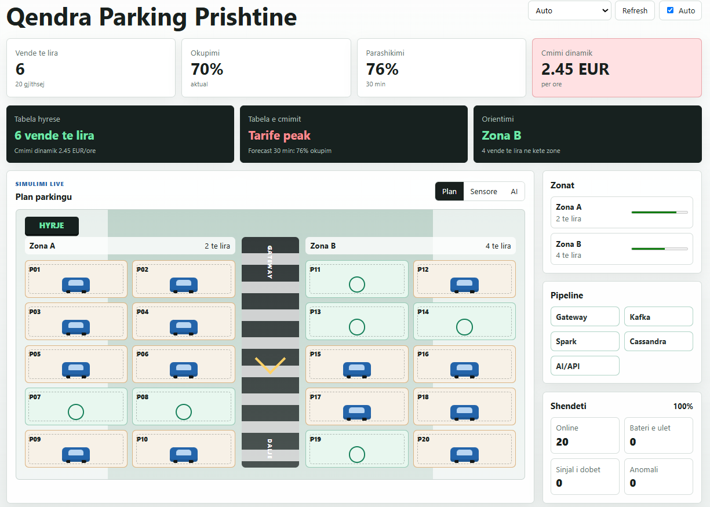
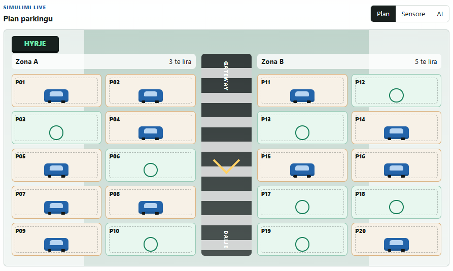
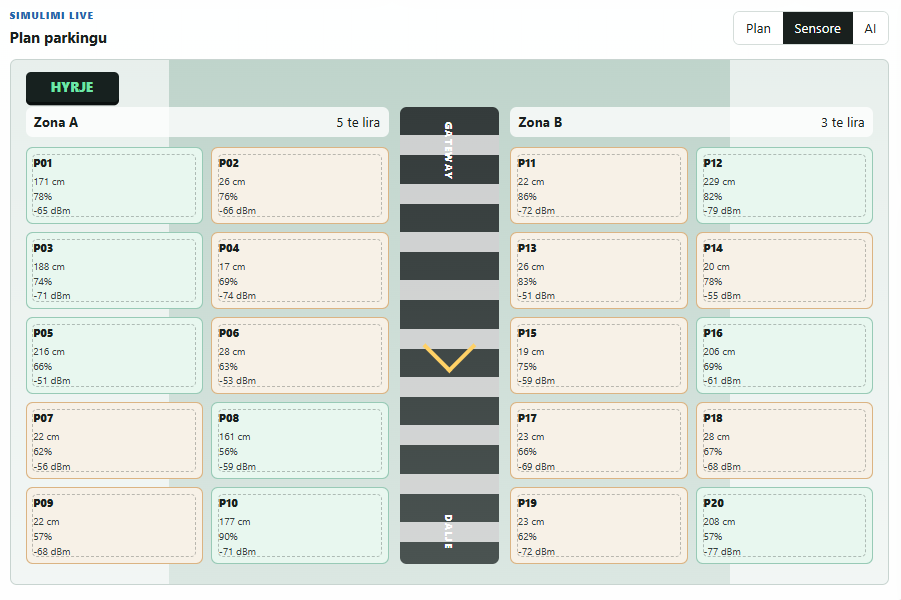
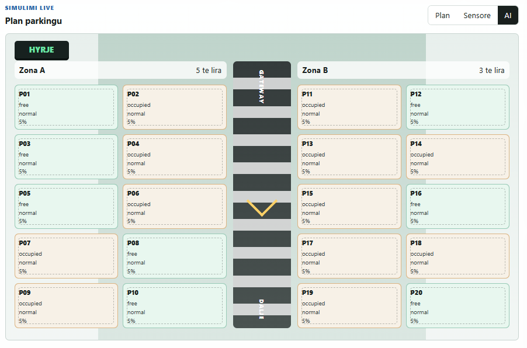
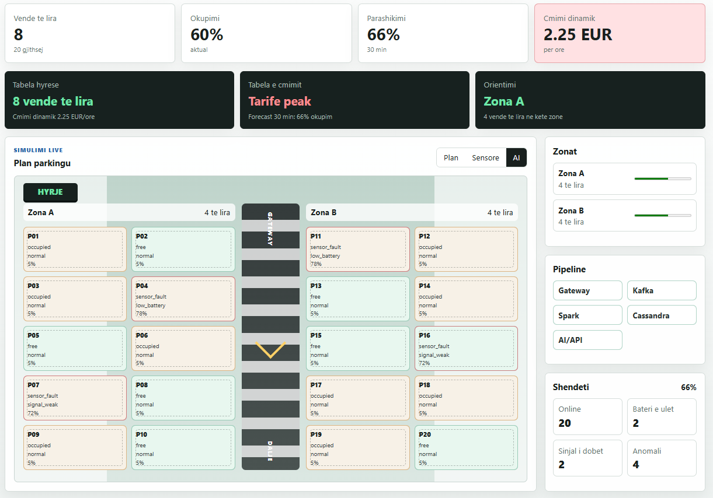

# Smart Parking Prishtina

Smart Parking Prishtina eshte nje projekt IoT per lenden *Internet of Things*. Projekti simulon nje parking urban ne Prishtine dhe e paraqet rrjedhen e plote te sistemit:

`sensor / simulator -> MQTT -> Kafka -> Spark Streaming -> Cassandra -> FastAPI / Vue Dashboard`

## Cfare realizon projekti

- simulon lexime nga sensoret e parkingut;
- i transmeton eventet ne kohe reale permes MQTT dhe Kafka;
- i proceson me Apache Spark Streaming;
- i ruan ne Apache Cassandra;
- i vizualizon ne dashboard web;
- llogarit parashikim, anomali, cmim dinamik dhe alarme;
- mban dashboard funksional edhe kur nuk ka te dhena live ne Cassandra, permes fallback simulation.

## Pajtueshmeria me kerkesat e projektit

| Kerkesa | Gjendja ne projekt | Ku gjendet | Shpjegim shtesë |
| --- | --- | --- | --- |
| Zgjedhja e domenit IoT | Po | Smart Parking Prishtine | Domen urban, i qarte dhe i afert me problemin real te gjetjes se vendeve te lira. |
| Sensor fizik ose simulator | Po | `app/simulator/run_simulator.py`, `app/services/simulation_snapshot_service.py` | PDF e lejon simulatorin nese nuk ka sensor fizik. |
| Mbledhje e te dhenave ne intervale te rregullta | Po | `SIMULATION_STEP_SECONDS`, `HEARTBEAT_SECONDS` ne `.env` / `app/settings.py` | Leximet dhe heartbeat-i gjenerohen periodikisht. |
| Transmetim me Apache Kafka | Po | `app/gateway/mqtt_consumer.py`, `app/gateway/kafka_producer.py`, `scripts/init_kafka_topics.py` | Gateway i dergon eventet ne `parking.raw-events`. |
| Kafka producer dhe consumer | Po | `app/gateway/kafka_producer.py`, `app/streaming/spark_streaming_processor.py` | Producer dhe consumer jane te ndare qarte. |
| Apache Spark Streaming | Po | `app/streaming/spark_streaming_processor.py` | Validim, filtrime, agregime me dritare dhe ruajtje ne Cassandra. |
| Apache Cassandra | Po | `config/cassandra/init.cql`, `app/storage/repositories.py` | Ruhet statusi aktual, historiku, AI dhe alarmet. |
| Nderfaqe per vizualizim | Po | `app/static/index.html`, `app/static/app.js`, `/dashboard` | Dashboard web me plan, zona, sensore, AI dhe health. |
| Dokumentacioni final | Po | `docs/FINAL_REPORT_STRICT.md` | Raporti final i strukturuar sipas kerkesave. |
| Sistemi funksional gjate mbrojtjes | Po | `scripts/start_strict_demo.ps1` | Demo-strict e ngre gjithe stack-un dhe ka fallback kur Cassandra s'ka rreshta. |
| Komponentet e avancuara AI | Po | `app/ai/prediction.py`, `app/ai/anomaly_detection.py`, `app/ai/classification.py`, `app/ai/dynamic_pricing.py` | Prediction, classification, anomaly detection dhe pricing. |
| Sistemi i alarmimeve | Po | `alerts_by_time`, `parking.sensor-alerts`, `/ai/alerts/latest` | Alarmet gjenerohen nga anomalite dhe validimet. |
| Analiza e performances dhe optimizimi | Po | `scripts/benchmark_pipeline.py`, checkpointing, `spark.sql.shuffle.partitions=2` | Ka benchmark lokal dhe tuning per demo/prototip. |

## Hapat sipas PDF-se

### 1. Zgjedhja e domenit IoT

Domeni eshte `Smart Parking`. Projekti fokusohet ne nje parking urban ne Prishtine, me 20 vende gjithsej dhe dy zona kryesore: Zona A dhe Zona B.

### 2. Mbledhja e te dhenave nga sensoret

Nuk ka sensor fizik, prandaj perdoret simulatori:

- `app/simulator/run_simulator.py` per rrjedhen live;
- `app/services/simulation_snapshot_service.py` per snapshot te gatshem per dashboard.

Per cdo vend parkimi gjenerohen te dhena si:

- `occupied`
- `distance_cm`
- `battery_level`
- `signal_strength`
- `event_type`
- `timestamp`
- `sensor_id`
- `spot_id`

### 3. Transmetimi i te dhenave ne server

Gateway pranon payload-et, i validon dhe i dergon ne Kafka.

- topic kryesor: `parking.raw-events`
- topic per alarmet: `parking.sensor-alerts`
- topic per AI: `parking.ai-input`

### 4. Procesimi me Apache Spark Streaming

Spark:

- lexon te dhenat nga Kafka;
- ben validime dhe filtrim te leximeve jo valide;
- krijon agregime me dritare kohore;
- llogarit metrika te okupimit;
- aplikon AI per prediction, classification dhe anomaly detection;
- llogarit cmimin dinamik;
- ruan rezultatet ne Cassandra.

### 5. Ruajtja ne Apache Cassandra

Rezultatet ruhen ne tabela te dizajnuara per query te shpejta sipas parkingut, vendit dhe kohes.

## Arkitektura

```text
Simulator / Sensor
    -> MQTT Gateway
    -> Kafka
    -> Spark Streaming
    -> Cassandra
    -> FastAPI
    -> Vue Dashboard
```

### Cfare ben secili komponent

- Simulatori gjeneron te dhenat e parkingut.
- MQTT Gateway i pranon dhe i normalizon.
- Kafka i transmeton si stream eventesh.
- Spark Streaming i proceson ne kohe reale.
- Cassandra i ruan te dhena e perpunuara.
- FastAPI i ekspozon endpoint-et e API-se.
- Dashboard-i Vue i paraqet te dhenat ne menyre vizuale dhe te lexueshme.

## Si funksionon dashboard-i

Dashboard-i hapet ne:

```text
http://127.0.0.1:8000/dashboard
```

Ai tregon:

- numrin e vendeve te lira;
- okupimin aktual;
- parashikimin per 30 minuta;
- cmimin dinamik per ore;
- planin vizual te parkingut;
- statusin e zonave;
- shendetin e sensoreve;
- statusin e pipeline-it;
- alarmet dhe anomalite.

### Si rifreskohet

- `Refresh` ben load te menjehershem.
- `Auto` ne krye e rifreskon faqen cdo 6 sekonda.
- Dropdown `Auto / morning_peak / afternoon_peak / evening_relief / maintenance` ndryshon skenarin e snapshot-it.

## Screenshotet e dashboard-it

Vendosi fotot reale ne `docs/images/` dhe perdor emrat me poshte. Kjo e ben README-n te vlefshem edhe per profesorin gjate leximit.

### 1. Overview i dashboard-it



### 2. Plan parkingu



### 3. Pamja e sensorave



### 4. Pamja AI dhe alarmet



### 5. Skenari maintenance me anomali



## Si simulohet nje anomali

Menyra me e sigurt per demo eshte skenari `maintenance`, sepse ai gjeneron me qellim disa sensore me problem.

### Opsioni me i thjeshte

Hap kete endpoint:

```text
http://127.0.0.1:8000/parking/simulation?scenario=maintenance
```

Ose, nese po sheh dashboard-in, zgjidh `maintenance` kur dashboard-i po perdor fallback snapshot.

### Cfare del si anomali

Ne skenarin `maintenance`, sistemi mund te krijoje:

- `low_battery`
- `signal_weak`
- `distance_outlier`

Keto shfaqen ne pamjen `AI` dhe ne alarmet e sistemit.

### Rregullat qe i perdor sistemi

- bateri nen 15% -> `low_battery`
- sinjal nen `-90` -> `signal_weak`
- vend i zene por distance shume e larte -> `distance_outlier`
- vend i lire por distance shume e ulet -> `distance_outlier`

### Shenim i rendesishem

Simulatori bazik `run_simulator.py` zakonisht mban vlera normale, prandaj `maintenance` eshte rruga me e mire per nje demo te garantuar.

## Tabelat kryesore ne Cassandra

Skema gjendet ne `config/cassandra/init.cql` dhe perfshin:

- `sensor_metadata_by_id`
- `sensor_events_by_spot`
- `current_spot_status`
- `parking_summary_by_minute`
- `sensor_window_metrics_by_minute`
- `ai_results_by_time`
- `alerts_by_time`

## Konfigurimi kryesor

Parametrat me te rendesishem jane ne `.env` dhe ne `.env.example`:

- `TOTAL_SPOTS=20`
- `SIMULATION_STEP_SECONDS=5`
- `HEARTBEAT_SECONDS=30`
- `BASE_PRICE_EUR=1.0`
- `PEAK_SURCHARGE_EUR=0.4`
- `MAX_PRICE_EUR=3.0`
- `MIN_PRICE_EUR=0.5`

Keto vlera shpjegojne pse dashboard-i ka 20 vende dhe pse cmimi dinamik ndryshon me okupimin dhe forecast-in.

## Si ta nis projektin

### Opsioni i rekomanduar per demo

```powershell
.\scripts\start_strict_demo.ps1
```

Ky skript:

1. ngren infrastrukturen Docker;
2. krijon Kafka topics;
3. inicializon skemen e Cassandra;
4. gjeneron dataset historik;
5. trajnon modelet AI;
6. tregon komandat qe duhen hapur ne terminale te ndara.

### Ngritja manuale

1. Krijo `.env` nga shembulli:

```powershell
Copy-Item .env.example .env
```

2. Ngrit infrastrukturen:

```powershell
docker compose -f docker/docker-compose.yml up -d
```

3. Krijo Kafka topics:

```powershell
python -m scripts.init_kafka_topics
```

4. Inicializo skemen e Cassandra:

```powershell
python -m app.storage.migrations
```

5. Gjenero dataset historik dhe trajno modelet:

```powershell
python -m scripts.seed_historical_data
python -m app.ai.train_models
```

6. Starto sherbimet kryesore ne terminale te ndara:

```powershell
python -m app.gateway.mqtt_consumer
python -m app.streaming.spark_streaming_processor
python -m app.simulator.run_simulator
uvicorn app.main:app --reload
```

7. Hap dashboard-in:

```text
http://127.0.0.1:8000/dashboard
```

### Nese Spark nuk niset lokalisht

Nese nuk ke Java ose Spark lokal, perdor:

```powershell
.\scripts\run_spark_in_docker.ps1
```

## Si ta ndalosh

Per t'i ndalur sherbimet Docker:

```powershell
docker compose -f docker/docker-compose.yml down
```

Per proceset Python ne terminale, perdor `Ctrl+C`.

## Si ta testosh projektin

```powershell
python -m pytest
python -m scripts.smoke_test
python -m scripts.benchmark_pipeline
```

- `pytest` teston kodin.
- `smoke_test` kontrollon nese API-ja eshte gjalle.
- `benchmark_pipeline` mat throughput-in lokal per validim dhe ML pa I/O te rrjetit.
